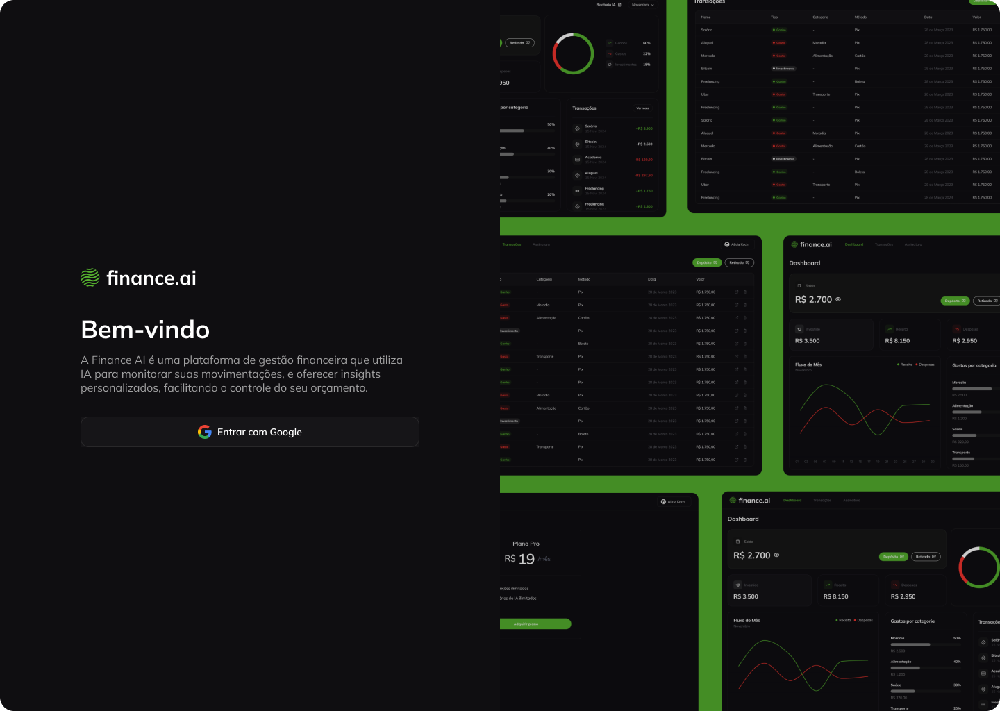

# Finance AI



Finance AI é uma aplicação de gerenciamento financeiro, projeto desenvolvido durante a sexta edição do _FSW (Full Stack Week)_.

## Executando o projeto

Clone este repositório.

Na raíz do projeto, crie um arquivo `.env` e preencha os valores necessários das variáveis conforme exemplo disponível em `.env.example`.

Caso deseje rodar um banco de dados localmente com docker, execute os comandos abaixo:

```bash
docker compose up -d
```

Com o arquivo configurado e o banco de dados já em execução, execute os comandos:

```bash
npm i
npx prisma migrate dev
npm run dev
```
